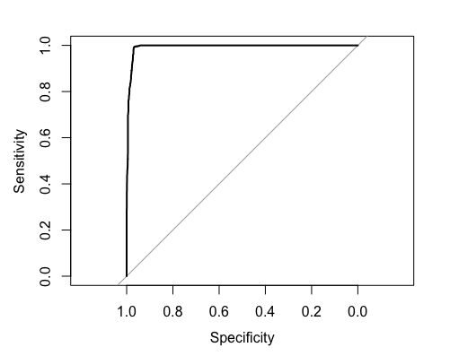

```{r setup, include=FALSE}
knitr::opts_chunk$set(echo = TRUE)
library(tidyverse)
library(corrplot)

```

This is a report showing the steps in taken in the project. For details, please refer to the code found in the _R_ folder. 

RMarkdown is a good way of showing the work that has been made in a format which can be exported into different formats. There is also the option of running notebooks in RStudio or other programs such as Jupyter Notebook.

### Summary of training data set
```{r data_exploration}
training <- readr::read_csv("../data/train_split.csv")

training %>% summary

```


### Class distribution in training set
```{r class_distribution, echo=FALSE}
training %>%  ggplot(aes(Class, fill = Class)) + 
  geom_bar() + 
  theme_bw() +
  ggtitle('Class distribution in dataset')

```

### Correlations

#### Pearson

```{r pearson, echo=FALSE}
training %>% 
  na.omit %>% 
  select(-Id) %>% 
  mutate(Class = if_else(Class == 'malignant', 1L, 0L)) %>% 
  cor(method = "pearson") %>% 
  corrplot()
```

#### Spearman

```{r spearman, echo=FALSE}
training %>% 
  na.omit %>% 
  select(-Id) %>% 
  mutate(Class = if_else(Class == 'malignant', 1L, 0L)) %>% 
  cor(method = "spearman") %>% 
  corrplot()
```

#### Bare.nuclei and Cell.size together with class

```{r class, echo=FALSE}
training %>% 
  ggplot(aes(Cell.size, Bare.nuclei, color = Class)) + 
  geom_point(size=1, position = position_jitter()) +
  theme_bw() 
```

### Result of modelling



### Performance on test set

```{r test_performance, echo=FALSE}
test_summary <- readr::read_csv("../data/test_summary.csv")
print(data.frame(test_summary))
```